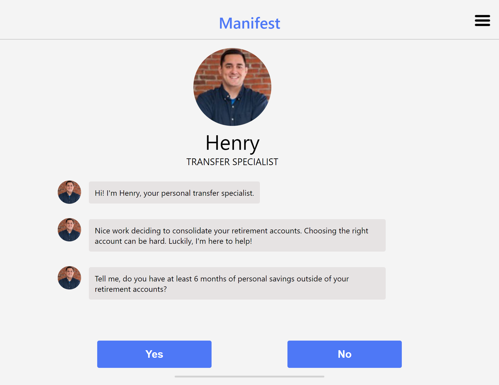

## Manifest Chatting App
This is an application using REACT that will interact with the user in a chat format. It gathers information from the user that will be used later to make a recommendation. **The source code is in master branch.** Here is the AWS link for the App - [AWS LINK TO MANIFEST CHATTING APP](http://manifestchattingapp.s3-website.us-east-2.amazonaws.com/)

## Screenshots


## Setup
To run this project, install it locally using npm:

```
$ cd ../manifest-chatting-app
$ npm install
$ npm start

